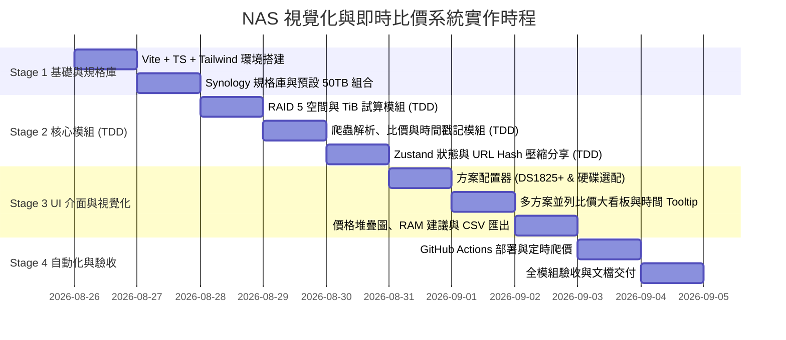

# NAS 視覺化與動態比價系統：需求補充分析與執行計畫書 (v2.0)

本文件基於 [`AGENTS.md`](file:///d:/project/nas_comparison/AGENTS.md) 與使用者最新反饋進行深度修訂。  
核心範疇聚焦於 **Synology NAS 系列（以 DS1825+ / DS1825neo+ 8-Bay 為核心）**、**預設 RAID 5**、**目標 $\ge$ 50TB 可用容量**、**報價時間標記與即時重整**、**記憶體 (RAM) 影響分析與建議**，以及 **URL Hash 零後端完美分享方案**。

---

## 1. 專案現況與需求規格精確化

### 1.1 機型範疇限縮（以 Synology 為核心）
- **第一階段專注機型**：
  - **Synology DS1825+**（旗艦 8-Bay，出廠預載 8GB DDR4 ECC，支援擴充至 32GB ECC，雙 2.5GbE，PCIe 3.0 擴充槽，2x M.2 NVMe）。
  - **Synology DS1825neo+**（高 CP 值 8-Bay，出廠預載 4GB DDR4 non-ECC，支援升級至 32GB ECC）。
  - **橫向比較對照機型**：
    - **DS1621+** (6-Bay / Ryzen V1500B / 4GB ECC)
    - **DS1522+** (5-Bay / Ryzen R1600 / 8GB ECC / 專用 10GbE 網卡插槽)
    - **DS923+** (4-Bay / Ryzen R1600 / 4GB ECC)

### 1.2 目標 $\ge$ 50TB 可用容量（預設 RAID 5 組合試算矩陣）
在 RAID 5 機制下，可用容量公式為 $(N - 1) \times \text{單顆最小硬碟容量}$。  
針對 8-Bay 機型（如 DS1825+），系統將預設提供並推薦以下滿足 $\ge 50\text{TB}$ 之高 CP 值方案組合：

| 方案編號 | 硬碟組合 (RAID 5) | 磁碟使用 Bay 數 | 剩餘空 Bay 數 | 標稱容量 (TB) | 真實可用容量 (TiB) | 方案特點與擴充彈性 |
| :--- | :--- | :--- | :--- | :--- | :--- | :--- |
| **方案 A (大容量高彈性)** | **4 顆 $\times$ 18TB** (如 Seagate 那嘶狼 Pro / WD 紅標 Pro) | 4 / 8 | **剩 4 Bay** | **54 TB** | **49.1 TiB** | 初期花費適中，保留 4 個空槽供未來無痛擴充。 |
| **方案 B (容量充裕推薦)** | **4 顆 $\times$ 20TB** | 4 / 8 | **剩 4 Bay** | **60 TB** | **54.5 TiB** | 突破 50 TiB 真實門檻，極高擴充空間。 |
| **方案 C (多顆均攤經濟型)**| **5 顆 $\times$ 14TB** 或 **5 顆 $\times$ 16TB** | 5 / 8 | **剩 3 Bay** | **56~64 TB** | **50.9~58.2 TiB**| 14TB/16TB 企業級硬碟每 TB 單價極低。 |
| **方案 D (槽位滿載型)** | **8 顆 $\times$ 8TB** 或 **8 顆 $\times$ 10TB** | 8 / 8 | 0 Bay (插滿) | **56~70 TB** | **50.9~63.6 TiB**| 插滿 8 槽，多硬碟並行讀寫 IOPS 表現優異，但無空槽。 |

### 1.3 NAS 記憶體 (RAM) 對一般使用影響深度分析與建議
使用者詢問：*「NAS 機器的記憶體對一般使用有多少影響？DS1825+ 預設 8GB RAM 是否足夠？」*

系統將在 UI 與比較報表中提供以下指引：
1. **純檔案存取、備份與檔案分享 (File Server & Backup)**：
   - **8GB RAM 非常充裕**。DSM 系統日常待機僅佔約 1.5GB ~ 2.5GB，剩餘的 RAM 會自動被 Linux 核心轉為 **Page Cache（檔案與 Btrfs Metadata 快取）**，多人讀取小檔案時更流暢。
2. **照片索引與協同辦公 (Synology Photos & Synology Drive)**：
   - 管理 50TB 資料庫（數十萬張照片人臉辨識、Drive 檔案多版本控制）時，**8GB 運作順暢**，記憶體使用率約在 50%~65% 之間。
3. **何時強烈建議升級到 16GB 或 32GB ECC？**
   - **Docker 容器 (Container Manager)**：若要在 NAS 上運行多個服務（如 GitLab、資料庫、監控系統 Prometheus/Grafana、Home Assistant 等）。
   - **Virtual Machine Manager (虛擬機)**：若要開啟 Windows 10/11 或 Linux 虛擬機（每台 VM 需分配 4GB~8GB RAM）。
   - **10GbE 高速網路傳輸**：升級 10G 網卡進行大型專案協作時，更大的快取能減少硬碟直接尋道等待。
4. **ECC (錯誤校正碼) 記憶體的重要性**：
   - DS1825+ 標配 8GB **ECC** RAM，能防止記憶體單元翻轉導致的靜態資料損毀（Silent Data Corruption），對 50TB 等級的企業關鍵資料極具保護力。升級時建議選購原廠或相容的 DDR4-3200 ECC SODIMM。

### 1.4 報價時間標記與即時刷新體驗 (Timestamp & Dynamic Refresh UX)
- **視覺呈現**：
  - 在頁面頂端與每筆商品報價卡片上，明確標示：`報價時間：2026-08-26 13:30 (原價屋) / 13:28 (欣亞)`。
  - 滑鼠游標移至價格上方時，跳出 Tooltip 說明：「此價格抓取自原價屋線上估價系統，點擊右上角『🔄 重新抓取』可即時連線更新」。
  - 提供顯眼的 **「🔄 立即重新整理最新報價」** 按鈕，點擊時顯示載入中動畫，完成後顯示更新狀態與價差變化提示。

### 1.5 URL Hash 無伺服器狀態完美分享架構 (Stateless URL Hash Sharing)
- **運作機制**：
  - 使用者在網頁上新增/刪除方案、更換機型、調整硬碟顆數/容量、選擇 RAM 升級、或手動修改價格時，前端狀態管理器（Zustand）會自動將當前所有方案狀態序列化，並透過 `lz-string` 壓縮成極短字串，同步寫入網址 Hash（例如 `https://your-pages-url/#/compare?data=N4Ig...`）。
  - **完美協作**：使用者只需點擊「複製分享連結」傳給同事，同事點開該 URL，前端解碼後將**百分之百完美重現一模一樣的配置畫面與比價矩陣**，完全無需後端伺服器或資料庫。

---

## 2. 系統架構設計 (System Architecture)

```mermaid
flowchart TD
    subgraph Data Sources [資料來源與即時擷取]
        C_PC[原價屋線上估價] -->|解析| P_MATCHER[SKU 正規化與價格匹配器]
        S_YA[欣亞線上估價] -->|解析| P_MATCHER
        P_MATCHER -->|GitHub Actions 定時產出| SNAPSHOT[public/data/prices.json<br/>含抓取 Timestamp]
        P_MATCHER -->|Local Dev Proxy / CORS API| LIVE_API[前端即時抓取]
    end

    subgraph Core Engines [核心計算引擎 (TDD)]
        SPEC_DB[Synology 規格庫<br/>DS1825+/DS1825neo+/配件] --> COMPAT[相容性驗證模組]
        COMPAT --> RAID_CALC[RAID 5 / SHR 空間計算<br/>50TB 門檻檢查與 TiB 換算]
        SNAPSHOT & LIVE_API --> PRICE_CALC[單店/最佳混搭比價模組<br/>NT$/TB 成本計算]
    end

    subgraph UI & State [前端互動與無狀態分享]
        RAID_CALC & PRICE_CALC --> STORE[Zustand 狀態管理]
        STORE <-->|即時雙向同步| URL_HASH[URL Hash 編碼/解碼<br/>完美分享連結]
        STORE --> UI_VIEW[多方案配置面板 & 比價大看板]
        STORE --> UI_CHARTS[價格堆疊圖 & 規格雷達圖]
        STORE --> UI_TIME[報價時間戳記 & 即時刷新按鈕]
    end
```

---

## 3. 技術選型 (Tech Stack)

| 領域 | 選定技術 | 理由與效益 |
| :--- | :--- | :--- |
| **前端核心** | **React 18 + TypeScript + Vite** | 極速建置、型別嚴謹、完美相容 GitHub Pages 靜態部署。 |
| **UI 樣式與圖標** | **Tailwind CSS + Lucide Icons** | 現代簡潔風格、響應式排版、提供豐富硬體與狀態圖標。 |
| **圖表視覺化** | **Recharts** | 互動式長條圖（價格結構）與雷達圖（規格評分），渲染流暢。 |
| **狀態與 URL 分享**| **Zustand + lz-string** | 零後端實現網址狀態無失真分享，壓縮率高且不超長。 |
| **單元測試 (TDD)** | **Vitest + @testing-library/react** | 極速執行單元測試，落實 Red-Green-Refactor 流程。 |
| **CI / CD** | **GitHub Actions** | 自動執行測試、建置、發布至 GitHub Pages，並定時爬取最新報價。 |

---

## 4. 階段式執行計畫 (Execution Plan)



### Stage 1: 專案基底搭建與 Synology 規格資料庫
1. 初始化 Vite + React + TypeScript + TailwindCSS 專案。
2. 配置 Vitest 測試環境與 ESLint。
3. 建立 Synology 規格庫（`src/data/nasModels.ts`）：
   - `DS1825+`（8-Bay, 8GB ECC 標配，雙 2.5GbE，2x M.2）
   - `DS1825neo+`（8-Bay, 4GB non-ECC 標配）
   - `DS1621+`, `DS1522+`, `DS923+`
4. 建立硬碟與配件庫（`src/data/accessories.ts`）：
   - NAS 專用 HDD（Seagate IronWolf / IronWolf Pro 8TB ~ 24TB、WD Red Plus / Pro 8TB ~ 24TB、Toshiba N300 / MG 系列）。
   - 原廠/相容 ECC DDR4 記憶體（8GB, 16GB）。
   - 10GbE / 2.5GbE 網路擴充卡、M.2 NVMe SSD 快取。

### Stage 2: 核心計算與比價模組實作 (TDD 閉環)
1. **RAID 5 與儲存空間計算引擎 (`src/utils/raidCalculator.ts`)**：
   - *Red*: 撰寫單元測試（包含對稱/非對稱硬碟、RAID 5 空間試算、50TB 門檻判定、TB 轉 TiB）。
   - *Green*: 實作 RAID 5 計算與剩餘 Bay 數統計邏輯。
   - *Refactor*: 優化空間試算與容錯提示。
2. **爬蟲解析與比價模組 (`src/services/scraper/` & `priceMatcher.ts`)**：
   - *Red*: 撰寫原價屋/欣亞模擬資料解析測試、品名模糊匹配測試、報價時間戳記提取測試。
   - *Green*: 實作價格正規化、單店最低價、混搭最低價計算與時間戳記保存。
   - *Refactor*: 建立快照 Fallback 機制。
3. **狀態管理與 URL Hash 壓縮分享 (`src/store/useComparisonStore.ts` & `urlSync.ts`)**：
   - *Red*: 撰寫狀態序列化、URL Hash 壓縮/解碼往返一致性測試。
   - *Green*: 實作 Zustand 狀態管理與 `lz-string` URL 自動雙向綁定。

### Stage 3: 互動介面與視覺化功能實作
1. **方案配置卡 (`PlanCard.tsx`)**：
   - 選擇 NAS 機型（預設 DS1825+）。
   - 選擇硬碟型號、容量與顆數（預設 4 顆 18TB / 54TB RAID 5）。
   - 記憶體擴充選單（附 8GB/16GB/32GB 使用場景建議與 Tooltip）。
2. **多方案並列比價大看板 (`ComparisonMatrix.tsx`)**：
   - 多欄對比：主機規格、使用 Bay / 剩餘 Bay、可用容量 (TB/TiB)、原價屋價格、欣亞價格、混搭最低價、每 TB 成本 (NT$/TB)。
   - **時間戳記與即時刷新區**：顯示各來源抓價時間，提供「🔄 立即重新整理最新報價」按鈕與 Hover 說明。
3. **視覺化圖表與報表匯出 (`VisualCharts.tsx` & `ExportModal.tsx`)**：
   - 價格結構堆疊圖（主機 vs 硬碟 vs 記憶體/配件）。
   - 一鍵「複製分享連結 (URL Hash)」與「匯出 CSV 採購評估表」。

### Stage 4: CI/CD、定時爬蟲與 GitHub Pages 部署
1. **GitHub Actions 部署管線 (`.github/workflows/deploy.yml`)**：
   - Push 時自動跑 Lint、Vitest 測試，並自動發布至 GitHub Pages。
2. **GitHub Actions 定時爬價管線 (`.github/workflows/update-prices.yml`)**：
   - 每日定時爬取原價屋與欣亞價格，產出帶時間戳記的 `public/data/prices.json`。
3. **端對端驗收與文檔**：
   - 驗證本地與線上版完整功能。

---

## 5. 完成定義 (Definition of Done - DoD)

1. **功能完整度**：
   - 預設載入 Synology DS1825+ 搭配滿足 $\ge 50\text{TB}$ 之 RAID 5 方案。
   - 介面清晰標示報價抓取時間，點擊重整可刷新。
   - 支援 URL Hash 即時複製與還原完整自訂方案。
   - 提供 RAM 升級建議與價格結構視覺化。
2. **測試標準**：
   - 核心計算與 URL 解碼單元測試覆蓋率 $\ge 90\%$，全測試通過。
3. **程式碼品質**：
   - 靜態代碼分析 (ESLint / TypeScript) 0 Error / 0 Warning。
4. **部署就緒**：
   - 本地 `npm run dev` 正常，GitHub Pages 網址開箱即用。
